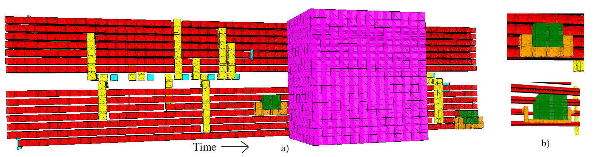

# OpenSurgery - lattice surgery compiler [](https://arxiv.org/abs/1906.07994)


<a href="https://docs.google.com/presentation/d/e/2PACX-1vQlTxLd73cyVqj9s2H7da_1lRfwQQmVVVxOEtrPmXSMwoFdwRayXYWexFPZyCMU1-gTsS1bOxJknmDZ/pub?start=true&loop=false&delayms=3000" target="-blank">A presentation about OpenSurgery</a>

To use OpenSurgery and to see something like [click here](https://alexandrupaler.github.io/opensurgery/)



* Make a virtualenv in the root: `virtualenv .venv`
* `source venv/bin/activate`
* `pip install cirq openfermion openfermioncirq`
* (maybe even) `export PYTHONPATH=.`
* `mkdir -p pickles/su2` and call `python manage/generate_su2.py` to generate necessary files for SKC in the folder `pickles`
* `python main.py`

For the moment, OpenSurgery uses a Python3 version of the SK compiler from https://github.com/cryptogoth/skc-python .


To cite, please use
```
@article{paler2019opensurgery,
  title={OpenSurgery for Topological Assemblies},
  author={Paler, Alexandru and Fowler, Austin G},
  journal={arXiv preprint arXiv:1906.07994},
  year={2019}
}
```
